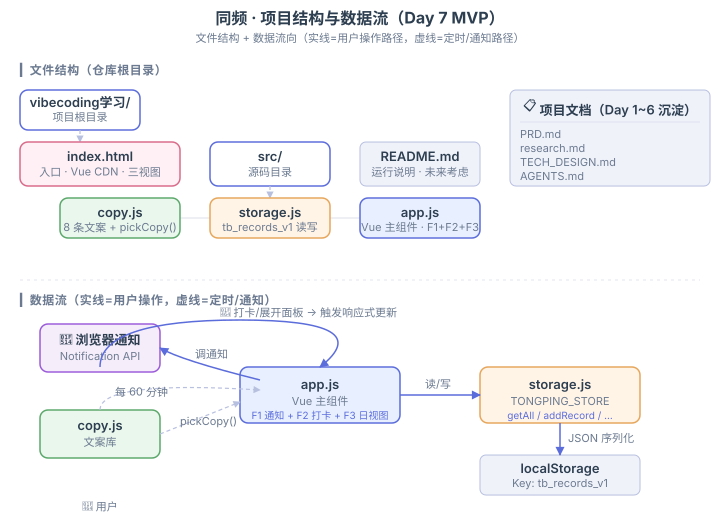

# 同频 · 学习状态伙伴

> **Day 7 MVP** · 到点提醒 + 手动打卡 + 日复盘，让"一个人的自习"有个"懂你的伙伴"。

## 怎么运行

### Python 3（推荐）

```bash
# 在项目根目录执行
python -m http.server 8000 --bind 127.0.0.1
```

### Node.js（备选）

```bash
npx serve -l 8000 .
```

打开浏览器 → **http://localhost:8000/**

> 浏览器通知 API 必须在 HTTP/HTTPS/Localhost 下才生效；直接 `file://` 打开 `index.html` 通知会失效，其他功能正常。

## 第一次打开做什么

1. 浏览器会问"是否允许通知"——点「允许」（MVP 依赖通知；不允许仍能手动打卡）
2. 等约 30 秒，第一次提醒会弹出；或者直接点「打卡」按钮开始
3. 滑动条打分 1-5（必填）+ 写一句话备注（选填，最多 100 字）→ 保存
4. 卡片出现在「今日记录」，完成度角标 +1
5. 点「打开日复盘」看今日完成度 / 平均分 / 今日总结 / 时间轴

## 文件结构

| 文件 | 作用 | 行数 |
|---|---|---|
| `index.html` | 入口（Vue 3 CDN + 三个视图 + CSS） | 220 |
| `src/copy.js` | F1 文案库（8 条混合调性：理性 3 / 暖心 2 / 毒舌 2 / 通用 1） | 84 |
| `src/storage.js` | F4 本地存储（`localStorage: tb_records_v1`，CRUD + 容错） | 102 |
| `src/app.js` | F1 + F2 + F3 Vue 主组件（通知 + 打卡 + 日视图） | 292 |
| `PRD.md` | Day 4 产品需求 | （已有） |
| `research.md` | Day 3 市场研究 | （已有） |
| `TECH_DESIGN.md` | Day 5 技术设计 | （已有） |
| `AGENTS.md` | Day 6 项目规则 | （已有） |

## 数据

- **存哪**：浏览器 `localStorage`，key = `tb_records_v1`
- **格式**：JSON 数组，每条记录 `{id, ts, score, note, skipped}`
- **备份**：MVP 不支持导出，**每周截图保命**（PRD 6.3 已知风险）

## 技术栈

- **Vue 3**（CDN 引入，jsdelivr，无构建工具）
- **浏览器 Notification API**
- **localStorage**
- **任意静态 server**（Python http.server / npx serve / Nginx 都行）

## 已知风险

| 风险 | 缓解 |
|---|---|
| localStorage 清缓存就丢数据 | 帮助区已提示"建议每周截图备份" |
| 浏览器通知需要用户授权 | 首次打开会主动请求 |
| 必须 HTTP/HTTPS 才能弹通知 | README 顶部提示，避免 `file://` 直接打开 |
| 移动端浏览器通知支持不稳定 | MVP 不针对移动端优化 |
| 数据无后端 = 多设备不互通 | 砍掉（PRD 5），D8+ 讨论 |

## 未来考虑（D8+ 任务池）

按用户今晚反馈整理：

- [ ] **任务清单模式**：前一天晚上 23:30 前自设明日任务清单，总分 100 分制（取代固定 8 次打卡）
- [ ] **P1 改清单视图**：从"卡片列表"改成"任务清单 + 勾选完成"
- [ ] **数据导出 JSON**：替代手动截图备份（本次曾加过又删，按用户偏好）
- [ ] **自动打分规则**：按时间段给分（早上 9 前高，越晚越低）
- [ ] **周/月/年复盘视图**（PRD 5 节砍掉，D8+ 重新评估）
- [ ] **AI 深度伙伴**：情绪感知 / 上下文记忆（PRD 5.1 砍掉）

## 关联文档



- `PRD.md` — Day 4 产品需求（MVP 边界 / 验收标准）
- `research.md` — Day 3 市场研究（机会定位 / 比较分析）
- `TECH_DESIGN.md` — Day 5 技术设计（Vue + Notification + localStorage 路线）
- `AGENTS.md` — Day 6 项目规则（协作方式 / Git 流程）

---

_Day 7 完成 · 2026-09-22_