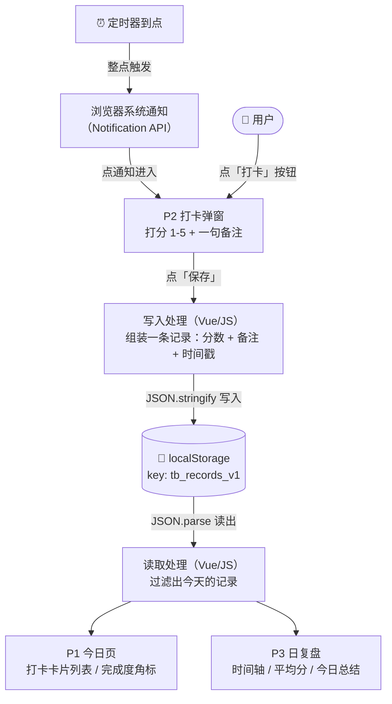

# TECH_DESIGN.md — 同频 · 技术设计

> Day 5 产出。回答三个问题：这个系统的零件怎么分工（第 1 节）、我们选了哪条技术路线、为什么（第 2 节）、数据从哪来、到哪去（第 3 节）。
> 上游文档：`research.md`（Day 3）→ `PRD.md`（Day 4）→ 本文（Day 5）→ Day 6 代码。

---

## 1. 前端、后端、数据库的分工

### 1.1 三个角色各管什么

| 角色 | 跑在哪 | 负责什么 | 天生限制 |
|---|---|---|---|
| **前端** | 用户的浏览器里 | 界面与交互：用户看到什么、点了有什么反应（HTML 结构 / CSS 外观 / JS 行为） | 浏览器一关就没了，自己留不住数据 |
| **后端** | 服务器上（7×24 运行） | 存数据、执行业务规则、账号认证 | 要部署、要运维，成本高 |
| **数据库** | 服务器上 | 专门存数据的仓库（MySQL / SQLite 等） | 一般只有后端能直接访问 |

典型的三方分工：用户点击 → **前端**发请求 → **后端**处理 → 读写**数据库** → 原路返回 → 前端显示。

### 1.2 同频的选择：无后端，localStorage 顶替数据库

**为什么可以没有后端**：MVP 没有账号、没有多用户、没有云同步（PRD 第 5 节均已砍掉），后端的核心职责只剩"记住打卡记录"一件事。

**localStorage 是什么**：浏览器内置的键值存储，相当于"存在用户自己浏览器里的迷你数据库"（容量约 5MB）。PRD 已约定数据存 `tb_records_v1` 这个 key 下。代价是**清缓存/换设备数据会丢**——PRD 6.3 已将此列为已知风险并接受。

### 1.3 有后端 vs 无后端（两种架构对比）

| | 无后端（同频采用） | 有后端 |
|---|---|---|
| 数据存哪 | 用户浏览器的 localStorage | 服务器上的数据库 |
| 换设备/换浏览器 | 数据不跟人走 | 数据跟账号走 |
| 多用户 | 不支持 | 支持 |
| 部署 | 静态文件拖上 EdgeOne Pages 即可 | 需要服务器 + 运维 |
| 开发量 | 只有前端一份代码 | 前端 + 后端 + 数据库三份 |

**结论**：MVP 阶段一切需求都在"单用户 + 单设备"内，无后端是成本最低、且完全够用的架构。

---

## 2. 技术路线

> **技术路线（一句话）：Vue 3（CDN 引入，无构建）+ 浏览器 Notification API + localStorage + EdgeOne Pages 静态托管。**

### 2.1 候选路线对比

| | 路线 A：纯 HTML + 原生 JS | **路线 B：Vue 3（CDN，无构建）✅ 选定** | 路线 C：前端 + 后端 + 数据库 |
|---|---|---|---|
| 是什么 | index.html + 几个 .js 文件，浏览器直接跑 | 静态文件，用 `<script>` 从 CDN 加载 Vue，页面用 Vue 语法写 | 服务器跑 Node.js，数据存 SQLite/云数据库 |
| 学习成本 | ★ 最低 | ★★ 需学 Vue 模板语法与响应式，约 1-2 天 | ★★★★ 服务器 + API + 数据库 + 部署 |
| Day 6 开发速度 | 快 | 中：交互（弹窗/列表）写起来顺手，但有上手成本 | 慢：前后端联调即可耗一天 |
| Day 7 部署 | 拖静态文件夹上 EdgeOne Pages | **同左**（CDN 版仍是静态文件） | 需服务器 + HTTPS 配置，成本高 |
| 数据存哪 | localStorage | localStorage | 真数据库，换设备不丢、可多用户 |
| 与 PRD 一致性 | ✅ | ✅（PRD 只要求纯前端静态，未限定 JS 写法） | ❌ 与"纯前端 MVP"冲突 |

### 2.2 为什么选 B（而不是我原本推荐的 A）

1. **产品形态匹配**：F1-F4 的界面（打卡弹窗、卡片列表、折叠面板）是典型的"状态驱动 UI"——数据一变、界面跟着变，这正是 Vue 的看家本领，用原生 JS 写这些"手动同步"代码反而啰嗦易错。
2. **学习投资**：Vue 是后续做任何正经前端项目都绕不开的技能，在 3 个视图的小项目里学，试错成本最低。
3. **不增加部署负担**：CDN 引入意味着没有构建工具、没有 node_modules，产物仍是静态文件夹，Day 7 的 EdgeOne Pages 计划一字不改。
4. **淘汰 C 的理由**：MVP 无账号、无多用户、无云同步（PRD 第 5 节），为不存在的需求上后端，是"为一个人盖公寓楼"。

### 2.3 已知风险与对策

- **风险**：Day 6 需要分出时间学 Vue 语法，可能挤压开发时间。
- **对策**：Day 6 开工前先给一份"最小 Vue 语法清单"（只覆盖本项目用到的：模板插值、v-if/v-for、v-model、事件绑定），不做系统学习；若当天进度受阻，降级方案是**该组件用原生 JS 重写**——静态页面里两种写法可以混用，不会推倒重来。

---

## 3. 数据流图

### 3.1 一句话版本（今天要掌握的那句话）

> **数据从用户的点击和到点的定时器来，在打卡弹窗里变成一条记录（分数+备注+时间），存进浏览器 localStorage，再从 localStorage 读出来，画成今日页的卡片和日复盘的时间轴——全程不离开用户自己的浏览器。**

### 3.2 图（Mermaid）

### 3.3 逐段解释（对着图从左上往右下读）

| 段 | 图里发生了什么 | 对应代码概念 |
|---|---|---|
| ① 入口 | 两个来源汇入 P2 弹窗：用户主动点「打卡」；定时器到点→发系统通知→用户点通知进来 | `setInterval` 定时 + `Notification` API |
| ② 产生数据 | 用户在 P2 里打分、写备注——**数据在这一刻才诞生**，之前系统里什么都没有 | 表单输入 |
| ③ 写入 | 点「保存」，程序把分数+备注+当前时间打包成一条记录，转成文本存进 localStorage | `JSON.stringify` + `setItem` |
| ④ 存储 | localStorage 里的 `tb_records_v1` 存着所有历史记录（一串文本形式的数组） | 浏览器持久化 |
| ⑤ 读出 | 页面加载或每次保存后，程序把文本转回数组，筛出今天的记录 | `JSON.parse` + `getItem` |
| ⑥ 展示 | 筛出的记录渲染到两处：P1 的卡片列表和角标，P3 的时间轴和统计 | Vue 响应式渲染 |

### 3.4 两个容易忽略的细节

1. **箭头是循环的**：每次「保存」之后都会重新走一遍 ⑤→⑥，所以 P1 会立刻多出一张卡片（对应 PRD F2 的验收标准）。
2. **图里没有服务器**：这是第 1 节"无后端架构"的直接结果——如果 Day 8 之后加云同步，这张图会多出一个"后端 API"的框，数据流从"进浏览器就到头"变成"出浏览器到服务器"。
